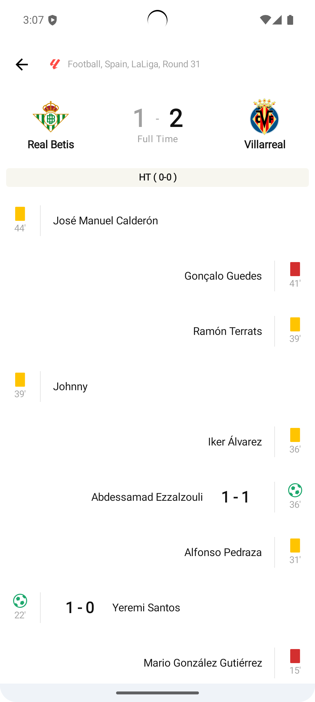
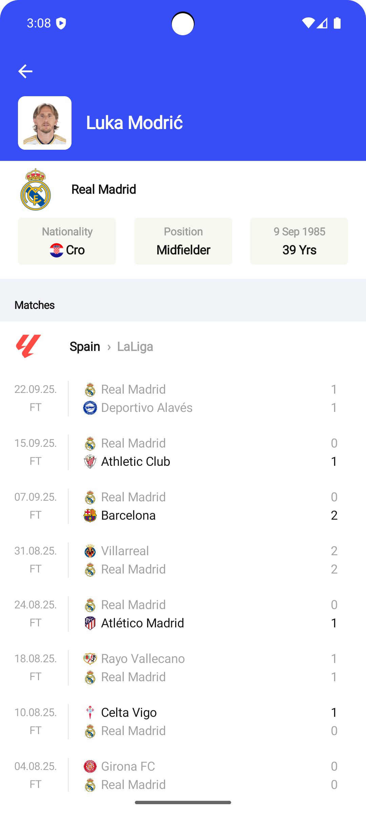
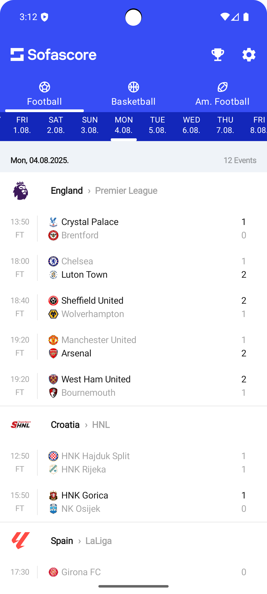
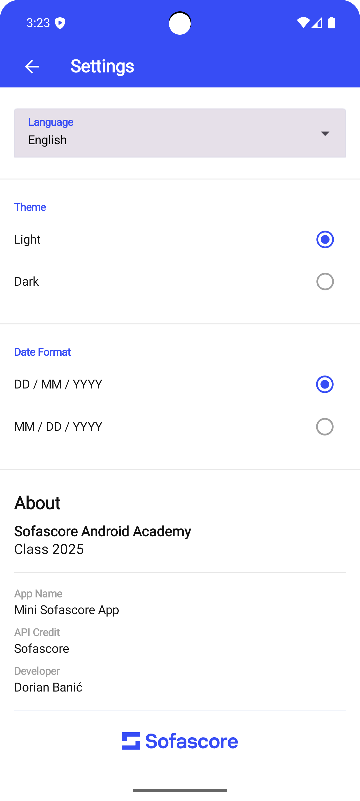

# MiniSofascore ⚽📱

**Sports Android App built with modern Android development tools and architecture.**  
MiniSofascore is a lightweight Android sports app developed as the final project for the **SofaScore Android Academy 2025**, designed to demonstrate clean code practices, Jetpack Compose UI, and robust architecture patterns using Kotlin and Jetpack libraries.

## ✨ Features & Tech Stack

- ✅ Jetpack Compose UI
- ✅ Clean MVI Architecture
- ✅ Multi-screen Navigation with type-safe routes
- ✅ Paging 3 for infinite scroll event list
- ✅ Hilt for dependency injection
- ✅ Retrofit for remote Api integration
- ✅ Image loading with Coil
- ✅ Repository pattern for data abstraction
- ✅ Coroutines + Flow for async state management
- ✅ Dynamic UI based on sport type (football, basketball, etc.)
- ✅ Player details with country flags, age calculation, and league info
- ✅ Tournament screen with Matches & Standings tabs
- ✅ Event details screen with all events and dynamic icon rendering (goals, cards etc.)
- ✅ Responsive design and dark theme support

## 📸 Screenshots

<table>
  <tr>
    <td></td>
    <td></td>
  </tr>
  <tr>
    <td></td>
    <td></td>
  </tr>
</table>

